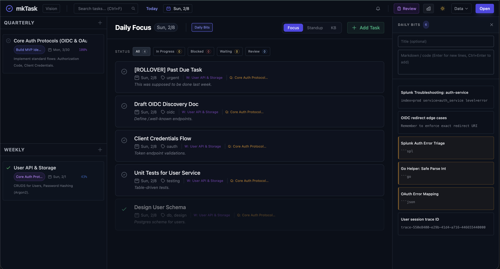
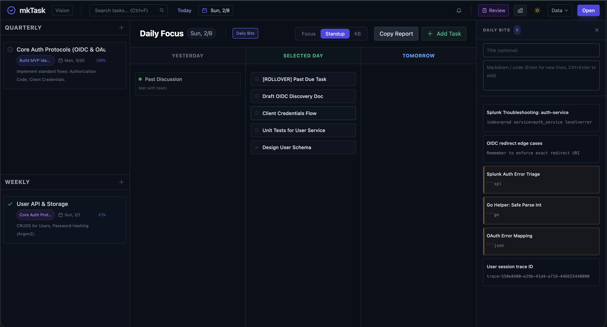
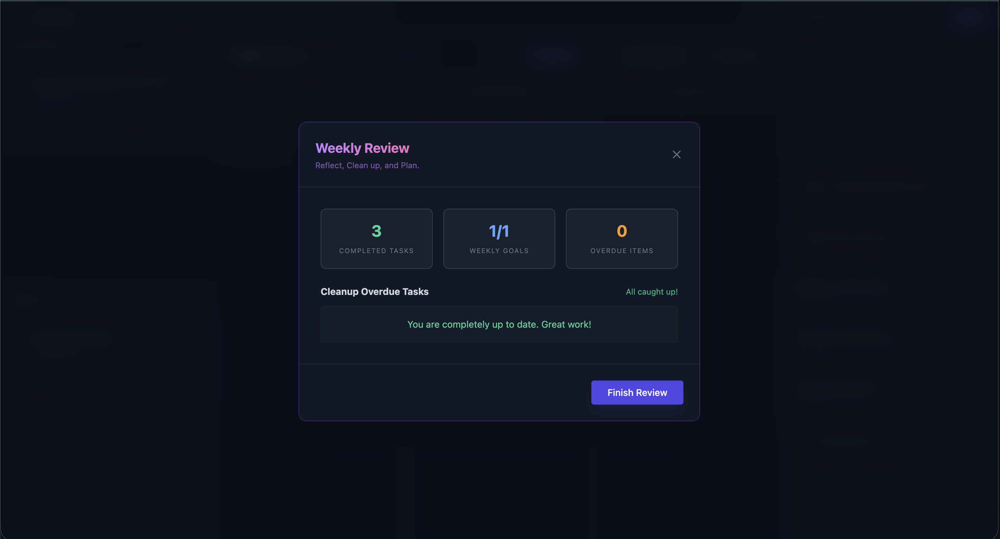
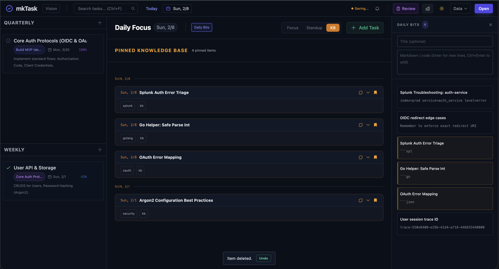
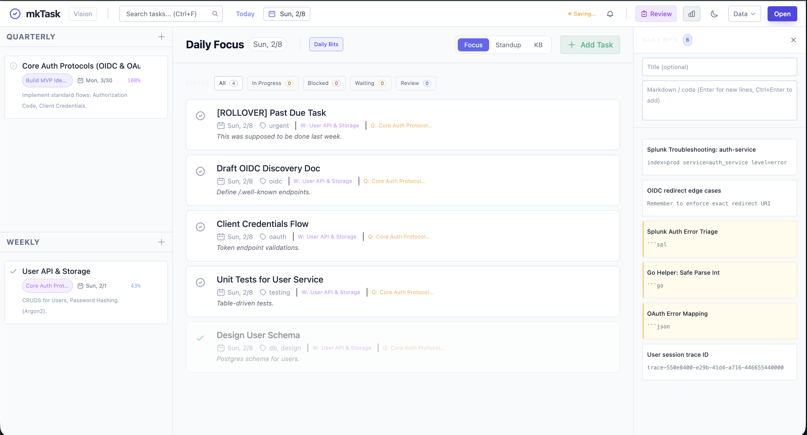

# mkTask

Goal: a lightweight, single-file task manager that keeps daily execution tied to bigger goals.

Specialty:
- One HTML file (Alpine.js + Tailwind) with no build step.
- Goal hierarchy: yearly, quarterly, weekly, daily.
- Daily Focus with quick status filtering and Next Action spotlight.
- In-progress state plus status tags (Blocked, Waiting, Review).
- Daily Bits sidebar and pinned Knowledge Base.

Files:
- mktask.html: the entire app (UI + logic) in a single file.
- sample_data.json: optional sample dataset for testing.

Data load/unload:
- Open: uses the browser file picker to load a saved JSON file.
- Auto-save: changes are stored in localStorage while you work.
- Export CSV: exports tasks as a CSV file.
- Load Sample Data: replaces current data with the sample dataset.
- Delete Database: clears localStorage for a fresh start.

